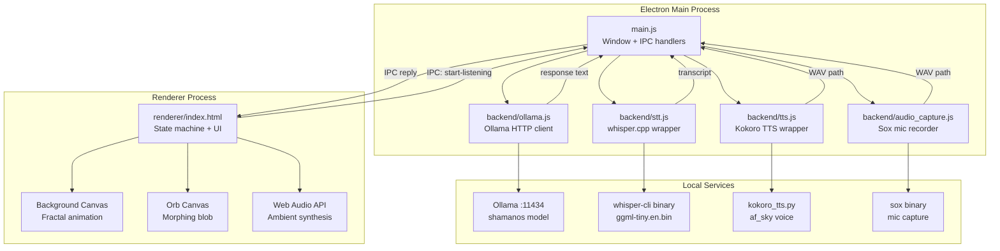
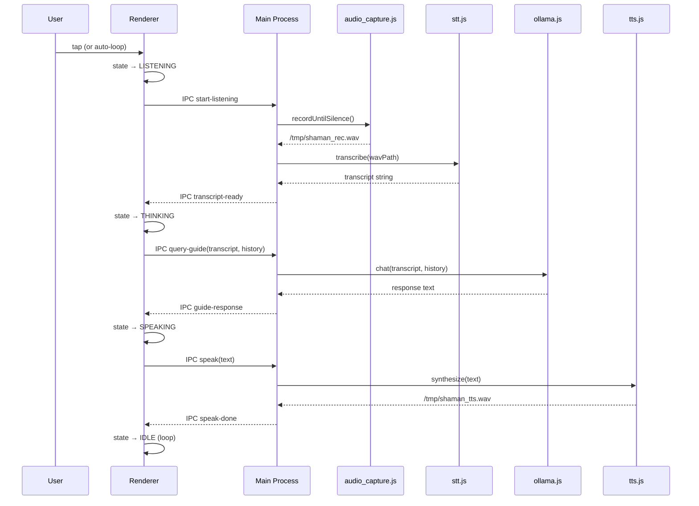
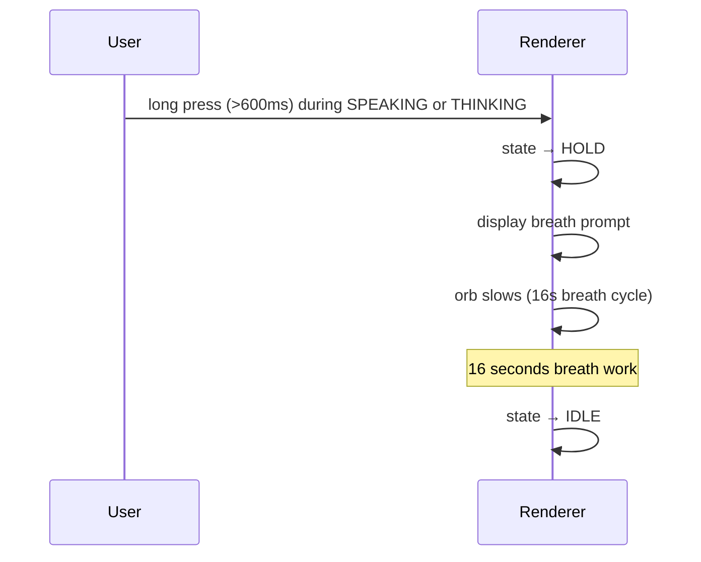
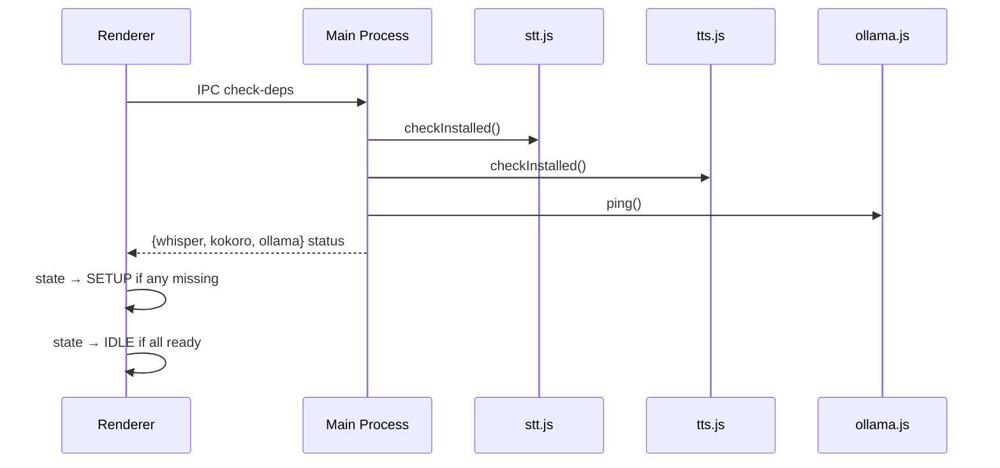

# Design Document: SHAMAN.OS Voice Application

## Overview

SHAMAN.OS is a fully offline, native macOS desktop application built with Electron that provides a psychedelic trip guide experience through a continuous voice loop. The user speaks, the Guide listens and responds through synthesized speech, ambient generative audio plays underneath, and a live fractal visual fills the screen — no buttons, no accounts, no network, no cloud.

The application is a closed sensory environment. Every component runs locally: inference via Ollama (localhost), speech-to-text via whisper.cpp, text-to-speech via Kokoro TTS, audio synthesis via Web Audio API, and visuals via Canvas 2D. The design prioritizes perceptual immersion over feature breadth.

## Architecture



## Sequence Diagrams

### Voice Loop — Happy Path



### HOLD Mode — Long Press



### Dependency Check — Startup



## Components and Interfaces

### main.js — Electron Main Process

**Purpose**: Creates the application window, owns all IPC handlers, orchestrates the voice pipeline.

**Interface** (IPC channels):

```typescript
// Inbound from renderer
ipcMain.handle('check-deps', (): DepsStatus
ipcMain.handle('start-listening', (): WavPath
ipcMain.handle('transcribe', (wavPath: string): string
ipcMain.handle('query-guide', (text: string, history: Message[]): string
ipcMain.handle('speak', (text: string): void
```

**Responsibilities**:
- Create 390×844 frameless window, backgroundColor `#020209`, fullscreen on macOS
- Request `microphone` permission via `systemPreferences.askForMediaAccess`
- Load `renderer/index.html`
- Delegate each IPC call to the appropriate backend module
- Pass errors back to renderer as `{ error: string }`

### preload.js — Context Bridge

**Purpose**: Exposes a safe `window.shaman` API to the renderer without exposing Node.

```typescript
window.shaman = {
  checkDeps(): Promise<DepsStatus>
  startListening(): Promise<string>        // returns WAV path
  transcribe(wavPath: string): Promise<string>
  queryGuide(text: string, history: Message[]): Promise<string>
  speak(text: string): Promise<void>
}
```

### backend/ollama.js — Inference Client

**Purpose**: Wraps the Ollama HTTP API with conversation history management.

```typescript
const HOST = 'http://localhost:11434'
const MODEL = 'shamanos'
const MAX_HISTORY = 6  // messages kept (3 turns)

async function ping(): Promise<boolean>
async function chat(userMessage: string, history: Message[]): Promise<string>
```

**System prompt** (from Modelfile, embedded):
> "You are the Guide — SHAMAN.OS. Calm, present psychedelic trip guide. Short present-tense sentences. Never dismiss. Never use: hallucination, just, it's okay, don't worry, your mind is. Ground through body, breath, presence."

**History management**: Keeps last `MAX_HISTORY` messages. Prepends system message on every request. Trims oldest pairs first.

### backend/audio_capture.js — Microphone Recorder

**Purpose**: Records microphone input via `sox` until silence is detected, writes a 16kHz mono WAV.

```typescript
const SAMPLE_RATE = 16000
const MIN_RECORD_DURATION = 0.8   // seconds
const SILENCE_DURATION = 1.5      // seconds of silence to stop
const MAX_DURATION = 120          // safety timeout

async function recordUntilSilence(): Promise<string>  // returns WAV path
```

**Sox command pattern**:
```
sox -d -r 16000 -c 1 /tmp/shaman_rec.wav silence 1 0.1 1% 1 1.5 1%
```

### backend/stt.js — Whisper STT

**Purpose**: Calls the compiled `whisper-cli` binary to transcribe a WAV file.

```typescript
const WHISPER_BIN = 'models/whisper.cpp/build/bin/whisper-cli'
const WHISPER_MODEL = 'models/ggml-tiny.en.bin'

async function transcribe(audioPath: string): Promise<string>
function checkInstalled(): boolean
```

**Invocation**:
```
whisper-cli -m ggml-tiny.en.bin -f /tmp/shaman_rec.wav --output-txt --no-timestamps
```

Returns trimmed stdout. Throws if binary or model missing.

### backend/tts.js — Kokoro TTS

**Purpose**: Calls `scripts/kokoro_tts.py` via Python subprocess to synthesize speech.

```typescript
const VOICE = 'af_sky'
const SPEED = 0.9

async function synthesize(text: string): Promise<string>  // returns WAV path
function checkInstalled(): boolean
```

**Python invocation**:
```
python scripts/kokoro_tts.py --text "..." --voice af_sky --speed 0.9 --out /tmp/shaman_tts.wav
```

### renderer/index.html — Complete UI

**Purpose**: Single-file renderer. Owns the state machine, all canvas animation, Web Audio synthesis, and IPC orchestration.

**State machine**:

```
IDLE ──tap──► LISTENING ──silence──► THINKING ──response──► SPEAKING ──done──► IDLE
              │                                                │
              └──────────────────────────────────────────────►│
                         long press (>600ms)                   │
                                                               ▼
                                                             HOLD (16s) ──► IDLE
```

**State visual mapping**:

| State     | Orb color       | Orb speed | Ambient volume |
|-----------|-----------------|-----------|----------------|
| IDLE      | deep violet     | 0.4×      | 0.30           |
| LISTENING | cyan-teal       | 1.2×      | 0.12           |
| THINKING  | amber-gold      | 0.8×      | 0.22           |
| SPEAKING  | warm white-rose | 1.0×      | 0.08           |
| HOLD      | deep indigo     | 0.15×     | 0.18           |
| SETUP     | grey            | 0.2×      | 0.00           |

## Data Models

### Message (conversation history)

```typescript
interface Message {
  role: 'user' | 'assistant'
  content: string
}
```

### DepsStatus

```typescript
interface DepsStatus {
  whisper: boolean
  kokoro: boolean
  ollama: boolean
  allReady: boolean
}
```

### AppState

```typescript
type AppState = 'IDLE' | 'SETUP' | 'LISTENING' | 'THINKING' | 'SPEAKING' | 'HOLD'
```

## Algorithmic Pseudocode

### Main Voice Loop

```pascal
PROCEDURE voiceLoop()
  INPUT: none
  OUTPUT: none (continuous side-effecting loop)

  SEQUENCE
    WHILE app IS running DO
      WAIT FOR state = IDLE
      WAIT FOR user tap event

      // Recording phase
      SET state ← LISTENING
      wavPath ← AWAIT shaman.startListening()

      // Transcription phase
      transcript ← AWAIT shaman.transcribe(wavPath)

      IF transcript IS empty OR transcript IS noise THEN
        SET state ← IDLE
        CONTINUE
      END IF

      // Inference phase
      SET state ← THINKING
      response ← AWAIT shaman.queryGuide(transcript, conversationHistory)
      APPEND {role: "user", content: transcript} TO conversationHistory
      APPEND {role: "assistant", content: response} TO conversationHistory
      TRIM conversationHistory TO last 6 messages

      // Speech phase
      SET state ← SPEAKING
      displayGuideText(response)
      AWAIT shaman.speak(response)

      SET state ← IDLE
    END WHILE
  END SEQUENCE
END PROCEDURE
```

**Preconditions**:
- All deps are installed and ready
- Ollama is running with `shamanos` model loaded
- Microphone permission granted

**Postconditions**:
- State always returns to IDLE after each cycle
- History never exceeds 6 messages
- Any error in any phase returns to IDLE without crashing

**Loop invariant**: `conversationHistory.length <= 6` at the start of every iteration

### HOLD Mode Interrupt

```pascal
PROCEDURE holdModeInterrupt()
  INPUT: longPressEvent (fired after 600ms hold)
  OUTPUT: none

  SEQUENCE
    IF state IN {SPEAKING, THINKING} THEN
      CANCEL any pending IPC calls
      SET state ← HOLD
      DISPLAY breath prompt text
      SET orbSpeed ← 0.15

      WAIT 16 seconds  // one breath cycle

      SET state ← IDLE
    END IF
  END SEQUENCE
END PROCEDURE
```

### Ambient Audio Synthesis

```pascal
PROCEDURE initAmbientAudio()
  INPUT: AudioContext
  OUTPUT: running audio graph

  SEQUENCE
    // Bass drone — 40Hz sine, gain 0.18
    bassDrone ← createOscillator(type: "sine", freq: 40)
    bassGain ← createGain(0.18)
    CONNECT bassDrone → bassGain → masterGain

    // Binaural beat — 200Hz carrier, 204Hz right (4Hz theta difference)
    beatLeft ← createOscillator(type: "sine", freq: 200)
    beatRight ← createOscillator(type: "sine", freq: 204)
    CONNECT beatLeft → leftChannel → masterGain
    CONNECT beatRight → rightChannel → masterGain

    // Slow pad — 80Hz triangle, LFO-modulated gain (0.05–0.12, period 8s)
    pad ← createOscillator(type: "triangle", freq: 80)
    padLFO ← createOscillator(type: "sine", freq: 0.125)
    CONNECT padLFO → padGain.gain
    CONNECT pad → padGain → masterGain

    // Shimmer — 2400Hz sine, gain 0.02
    shimmer ← createOscillator(type: "sine", freq: 2400)
    shimmerGain ← createGain(0.02)
    CONNECT shimmer → shimmerGain → masterGain

    START all oscillators
  END SEQUENCE
END PROCEDURE

PROCEDURE setAmbientVolume(state: AppState)
  INPUT: state
  OUTPUT: none

  SEQUENCE
    targetGain ← VOLUME_MAP[state]  // {IDLE:0.30, LISTENING:0.12, THINKING:0.22, SPEAKING:0.08, HOLD:0.18}
    masterGain.gain.linearRampToValueAtTime(targetGain, now + 1.5)
  END SEQUENCE
END PROCEDURE
```

### Background Canvas — Fractal Animation

```pascal
PROCEDURE drawBackgroundFrame(t: float)
  INPUT: t = elapsed time in seconds
  OUTPUT: pixels drawn to background canvas

  SEQUENCE
    CLEAR canvas with rgba(2, 2, 9, 0.15)  // trail fade

    // Rotating 3D polyhedra (projected to 2D)
    FOR each polyhedron IN polyhedra DO
      rotX ← t * polyhedron.rotSpeedX
      rotY ← t * polyhedron.rotSpeedY
      projected ← project3D(polyhedron.vertices, rotX, rotY, focalLength: 400)
      DRAW edges with strokeStyle = polyhedron.color, alpha = 0.3
    END FOR

    // Lissajous knot
    FOR i FROM 0 TO 360 DO
      θ ← i * (π / 180)
      x ← sin(3θ + t * 0.3) * 0.35 * width + centerX
      y ← cos(2θ + t * 0.2) * 0.35 * height + centerY
      PLOT point at (x, y) with color hsla(200 + i*0.5, 70%, 60%, 0.4)
    END FOR

    // Spirograph petals (5 petals, rotating)
    FOR petal FROM 0 TO 4 DO
      angle ← petal * (2π / 5) + t * 0.1
      DRAW petal curve centered at (centerX, centerY) with radius 120
    END FOR

    // Corner tendrils (4 corners, bezier curves growing outward)
    FOR each corner IN corners DO
      DRAW bezier tendril from corner, length = 80 + sin(t * 0.7) * 20
    END FOR
  END SEQUENCE
END PROCEDURE
```

### Orb Canvas — Morphing Blob

```pascal
PROCEDURE drawOrbFrame(t: float, state: AppState)
  INPUT: t = elapsed time, state = current app state
  OUTPUT: pixels drawn to orb canvas

  SEQUENCE
    speed ← ORB_SPEED_MAP[state]
    baseRadius ← 120
    vertices ← 80

    // Outer blob — 5 harmonic noise functions
    points ← []
    FOR i FROM 0 TO vertices - 1 DO
      θ ← i * (2π / vertices)
      r ← baseRadius
      FOR h FROM 1 TO 5 DO
        r ← r + sin(h * θ + t * speed * h * 0.3) * (20 / h)
      END FOR
      APPEND (centerX + r * cos(θ), centerY + r * sin(θ)) TO points
    END FOR
    DRAW smooth closed path through points with gradient fill

    // Inner blob — same technique, 0.6× scale
    DRAW inner blob at 0.6 * baseRadius

    // Star-tetrahedron overlay (2 overlapping triangles, rotating)
    DRAW triangle1 rotated at t * speed * 0.4
    DRAW triangle2 rotated at -t * speed * 0.4

    // Radial spokes (12 spokes, pulsing length)
    FOR spoke FROM 0 TO 11 DO
      angle ← spoke * (2π / 12) + t * speed * 0.1
      length ← baseRadius * 1.4 + sin(t * speed * 2 + spoke) * 15
      DRAW line from center at angle, length = length, alpha = 0.15
    END FOR
  END SEQUENCE
END PROCEDURE
```

## Key Functions with Formal Specifications

### ollama.chat()

```javascript
async function chat(userMessage, history)
```

**Preconditions**:
- `userMessage` is a non-empty string
- `history` is an array of `{role, content}` objects, length ≤ 6
- Ollama service is reachable at `localhost:11434`
- `shamanos` model is loaded

**Postconditions**:
- Returns a non-empty string (the Guide's response)
- Response is ≤ 200 tokens (enforced by `num_predict: 200`)
- Throws on network error or non-2xx HTTP response

**Loop invariants**: N/A (single HTTP request)

### audio_capture.recordUntilSilence()

```javascript
async function recordUntilSilence()
```

**Preconditions**:
- `sox` binary is on PATH
- Microphone permission granted
- `/tmp` is writable

**Postconditions**:
- Returns path to a valid 16kHz mono WAV file
- WAV duration ≥ `MIN_RECORD_DURATION` (0.8s)
- WAV duration ≤ `MAX_DURATION` (120s)
- Throws if sox exits with non-zero code

### stt.transcribe()

```javascript
async function transcribe(audioPath)
```

**Preconditions**:
- `audioPath` points to a readable WAV file
- `WHISPER_BIN` binary exists and is executable
- `WHISPER_MODEL` file exists

**Postconditions**:
- Returns trimmed transcript string (may be empty if no speech detected)
- Throws if binary exits with non-zero code

### tts.synthesize()

```javascript
async function synthesize(text)
```

**Preconditions**:
- `text` is a non-empty string
- Python 3 is available
- `kokoro` package is installed
- `scripts/kokoro_tts.py` exists

**Postconditions**:
- Returns path to a valid WAV file at `/tmp/shaman_tts_<timestamp>.wav`
- Throws if Python subprocess exits with non-zero code

## Error Handling

### Scenario 1: Ollama not running

**Condition**: `ping()` returns false at startup or `chat()` throws `ECONNREFUSED`
**Response**: Renderer shows SETUP state with message "Start Ollama: `ollama serve`"
**Recovery**: Renderer polls `check-deps` every 5 seconds; transitions to IDLE when ready

### Scenario 2: Empty transcript

**Condition**: Whisper returns empty string or only whitespace/noise tokens (`[BLANK_AUDIO]`, `[MUSIC]`)
**Response**: Silently return to IDLE state, no error shown
**Recovery**: Automatic — loop continues

### Scenario 3: whisper.cpp not compiled

**Condition**: `checkInstalled()` returns false
**Response**: SETUP state shows "Run: `bash scripts/setup_whisper.sh`"
**Recovery**: User runs setup script; app re-checks on next `check-deps` poll

### Scenario 4: Kokoro TTS failure

**Condition**: Python subprocess exits non-zero
**Response**: Skip TTS, display guide text only, return to IDLE
**Recovery**: Automatic — voice loop continues silently

### Scenario 5: Long press interrupt during pipeline

**Condition**: User holds >600ms while state is SPEAKING or THINKING
**Response**: Cancel pending IPC, enter HOLD state immediately
**Recovery**: After 16s breath cycle, return to IDLE

## Testing Strategy

### Unit Testing Approach

Test each backend module in isolation using Node's built-in `assert` or Jest:
- `ollama.js`: mock `fetch`, verify system prompt injection, history trimming to 6 messages
- `audio_capture.js`: mock `child_process.spawn`, verify sox command construction, timeout behavior
- `stt.js`: mock `child_process.execFile`, verify argument construction, empty-transcript handling
- `tts.js`: mock `child_process.spawn`, verify Python invocation, output path generation

### Property-Based Testing Approach

**Property Test Library**: fast-check

Key properties to verify:
- `chat(msg, history)` — for any history array of length > 6, trimmed history sent to Ollama is always ≤ 6 messages
- `recordUntilSilence()` — returned WAV path always matches `/tmp/shaman_rec_*.wav` pattern
- State machine — from any state, a valid event always produces a valid next state (no undefined transitions)
- Orb blob — for any `t ≥ 0`, all 80 computed vertex coordinates are finite numbers (no NaN/Infinity)

### Integration Testing Approach

Manual integration checklist (no automated integration tests — all deps are native binaries):
- Full voice loop: speak → transcribe → infer → synthesize → play
- HOLD interrupt at each pipeline stage
- Startup with Ollama down → SETUP state → Ollama starts → auto-transition to IDLE
- 10-minute continuous session: no memory leak, no zombie processes

## Performance Considerations

- Whisper tiny.en model: ~75MB, ~1–3s transcription on Apple Silicon
- Kokoro 82M model: ~330MB, ~0.5–1.5s synthesis on Apple Silicon
- Ollama shamanos (Q4_K_M): ~700MB VRAM/RAM, ~1–4s first token on Apple Silicon
- Canvas animation: both canvases run at `requestAnimationFrame` (60fps); orb uses `willReadFrequently: false`
- Audio: all Web Audio nodes created once at startup, never recreated; volume changes use `linearRampToValueAtTime`
- IPC: all backend calls are async; renderer never blocks on main process

## Security Considerations

- No network requests except `localhost:11434` (Ollama)
- No file system access from renderer (all file I/O in main process via IPC)
- `contextIsolation: true`, `nodeIntegration: false` in BrowserWindow
- Preload script uses `contextBridge.exposeInMainWorld` — no raw Node APIs exposed
- Temp files written to `/tmp/shaman_*` — cleaned up after each use
- No user data persisted to disk (no session logs, no history files)

## Dependencies

| Dependency | Version | Purpose |
|---|---|---|
| electron | ^28 | Desktop runtime |
| ollama | running locally | LLM inference |
| whisper.cpp | compiled from source | Speech-to-text |
| kokoro | pip install kokoro | Text-to-speech |
| sox | brew install sox | Microphone capture |
| Python 3.9+ | system | Kokoro TTS subprocess |
| Node.js 18+ | bundled with Electron | Backend modules |

**Google Fonts** (loaded at startup, cached — only external network call):
- Rajdhani 300 (guide text)
- Share Tech Mono (status labels)
