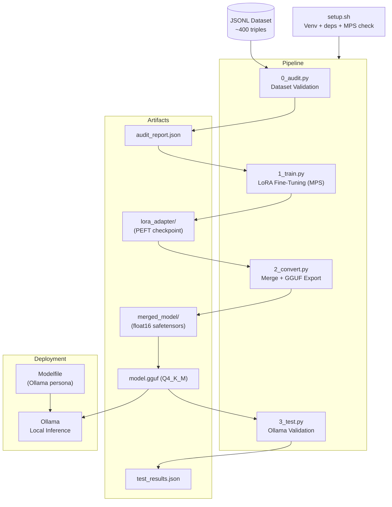
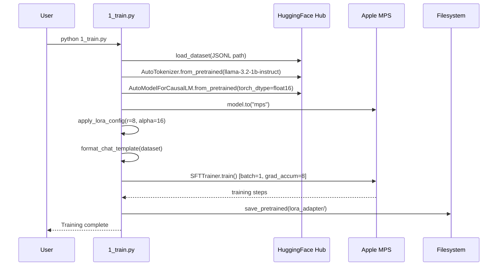
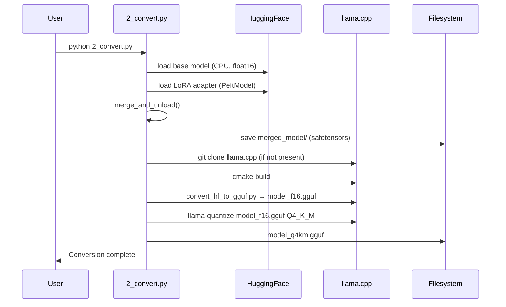

# Design Document: SHAMAN.OS Fine-Tune Pipeline

## Overview

The SHAMAN.OS Fine-Tune Pipeline is a fully local, end-to-end machine learning pipeline that audits a JSONL dataset, fine-tunes Llama 3.2 1B Instruct using LoRA on Apple Silicon (MPS), merges and exports the adapter to GGUF Q4_K_M format, and validates the result via Ollama. Every architectural decision prioritizes memory efficiency to remain within an 8GB unified RAM budget, with no cloud dependencies at any stage.

The pipeline is structured as four sequential, independently runnable Python scripts (`0_audit.py` → `1_train.py` → `2_convert.py` → `3_test.py`) plus supporting files for environment setup and deployment. The output is a quantized GGUF model ready for on-device inference via Ollama.

The design targets Apple Silicon Macs exclusively. Training uses the MPS (Metal Performance Shaders) backend for GPU acceleration. Quantization is handled by `llama.cpp` compiled locally. No RunPod, no cloud APIs, no Docker.

---

## Architecture



---

## Sequence Diagrams

### Training Flow



### Conversion Flow



---

## Components and Interfaces

### Component 1: Dataset Auditor (`0_audit.py`)

**Purpose**: Validates the JSONL dataset for structural integrity, content quality, and training suitability before any compute is spent.

**Interface**:
```python
def run_audit(dataset_path: str, output_path: str = "audit_report.json") -> AuditReport
def check_structure(record: dict, idx: int) -> list[AuditFlag]
def check_empty_fields(record: dict, idx: int) -> list[AuditFlag]
def check_field_lengths(records: list[dict]) -> FieldLengthStats
def check_literary_analysis(record: dict, idx: int) -> list[AuditFlag]
def check_first_person(record: dict, idx: int) -> list[AuditFlag]
def check_duplicates(records: list[dict], threshold: float = 0.70) -> list[AuditFlag]
def check_sequence_length(record: dict, idx: int, max_tokens: int = 512) -> list[AuditFlag]
```

**Responsibilities**:
- Load and parse JSONL line-by-line
- Run 7 validation checks, collect flags with indices
- Compute aggregate statistics (word counts, duplicate pairs)
- Write `audit_report.json` with all flags and summary stats

---

### Component 2: LoRA Trainer (`1_train.py`)

**Purpose**: Fine-tunes Llama 3.2 1B Instruct with LoRA on MPS, staying within 8GB RAM.

**Interface**:
```python
def load_model_and_tokenizer(model_id: str) -> tuple[AutoModelForCausalLM, AutoTokenizer]
def apply_lora(model: AutoModelForCausalLM, config: LoraConfig) -> PeftModel
def format_dataset(dataset: Dataset, tokenizer: AutoTokenizer) -> Dataset
def build_trainer(model: PeftModel, tokenizer: AutoTokenizer, dataset: Dataset, args: SFTConfig) -> SFTTrainer
def train(trainer: SFTTrainer) -> TrainOutput
```

**Responsibilities**:
- Detect MPS vs CUDA vs CPU and configure accordingly
- Load model in float16 (MPS) or 4-bit (CUDA/CPU fallback)
- Apply LoRA with r=8, alpha=16 targeting attention projection layers
- Format dataset using the model's chat template
- Run SFTTrainer with memory-safe hyperparameters
- Save only the LoRA adapter (not full weights)

---

### Component 3: Model Converter (`2_convert.py`)

**Purpose**: Merges LoRA adapter into base weights, then converts and quantizes to GGUF Q4_K_M.

**Interface**:
```python
def merge_adapter(base_model_id: str, adapter_path: str, output_path: str) -> None
def clone_llama_cpp(target_dir: str) -> None
def build_llama_cpp(llama_cpp_dir: str) -> None
def convert_to_gguf_f16(llama_cpp_dir: str, model_path: str, output_path: str) -> None
def quantize_to_q4km(llama_cpp_dir: str, f16_path: str, output_path: str) -> None
```

**Responsibilities**:
- Load base model on CPU in float16 to avoid MPS memory pressure during merge
- Merge and unload LoRA weights into base model
- Save merged model as safetensors
- Clone and build llama.cpp if not already present
- Run GGUF conversion and Q4_K_M quantization via subprocess

---

### Component 4: Model Tester (`3_test.py`)

**Purpose**: Validates the fine-tuned GGUF model against the base model using 5 standardized prompts via Ollama API.

**Interface**:
```python
def import_model_to_ollama(modelfile_path: str, model_name: str) -> None
def run_prompt(model_name: str, prompt: str, system: str) -> str
def compare_responses(prompts: list[TestPrompt], ft_model: str, base_model: str) -> list[TestResult]
def save_results(results: list[TestResult], output_path: str) -> None
```

**Responsibilities**:
- Import GGUF into Ollama using the Modelfile
- Run 5 test prompts against both fine-tuned and base model
- Capture and compare responses
- Save structured results to `test_results.json`

---

## Data Models

### AuditFlag

```python
@dataclass
class AuditFlag:
    index: int           # record index in JSONL
    check: str           # name of the check that flagged it
    severity: str        # "error" | "warning" | "info"
    message: str         # human-readable description
    detail: dict         # check-specific metadata
```

### AuditReport

```python
@dataclass
class AuditReport:
    total_records: int
    flags: list[AuditFlag]
    field_length_stats: FieldLengthStats
    duplicate_pairs: list[tuple[int, int]]
    summary: dict[str, int]   # count per check name
```

### FieldLengthStats

```python
@dataclass
class FieldLengthStats:
    min_words: int
    max_words: int
    mean_words: float
    median_words: float
    too_short: list[int]   # indices with < 10 words
    too_long: list[int]    # indices with > 300 words
```

### TestPrompt

```python
@dataclass
class TestPrompt:
    name: str        # e.g. "acute_entity_presence"
    system: str      # system prompt
    user: str        # user message
```

### TestResult

```python
@dataclass
class TestResult:
    prompt_name: str
    finetuned_response: str
    base_response: str
    timestamp: str
```

### LoRA Configuration

```python
LoraConfig(
    r=8,
    lora_alpha=16,
    target_modules=["q_proj", "v_proj", "k_proj", "o_proj"],
    lora_dropout=0.05,
    bias="none",
    task_type="CAUSAL_LM"
)
```

### Training Configuration

```python
SFTConfig(
    output_dir="lora_adapter",
    num_train_epochs=3,
    per_device_train_batch_size=1,
    gradient_accumulation_steps=8,
    learning_rate=2e-4,
    max_seq_length=512,
    fp16=True,                        # MPS path
    gradient_checkpointing=True,
    optim="adamw_torch",
    dataloader_pin_memory=False,      # required for MPS
    dataloader_num_workers=0,         # required for Mac
    save_strategy="epoch",
    logging_steps=10,
    report_to="none"
)
```

---

## Algorithmic Pseudocode

### Audit Algorithm

```pascal
ALGORITHM run_audit(dataset_path, output_path)
INPUT: dataset_path: String, output_path: String
OUTPUT: AuditReport written to output_path

BEGIN
  records ← load_jsonl(dataset_path)
  flags ← []
  
  FOR idx, record IN enumerate(records) DO
    ASSERT record is dict
    flags.extend(check_structure(record, idx))
    flags.extend(check_empty_fields(record, idx))
    flags.extend(check_literary_analysis(record, idx))
    flags.extend(check_first_person(record, idx))
    flags.extend(check_sequence_length(record, idx, max_tokens=512))
  END FOR
  
  stats ← check_field_lengths(records)
  dup_flags ← check_duplicates(records, threshold=0.70)
  flags.extend(dup_flags)
  
  report ← AuditReport(
    total_records=len(records),
    flags=flags,
    field_length_stats=stats,
    duplicate_pairs=extract_pairs(dup_flags),
    summary=count_by_check(flags)
  )
  
  write_json(report, output_path)
  print_summary(report)
  RETURN report
END
```

**Preconditions:**
- `dataset_path` points to a valid, readable JSONL file
- Each line is valid JSON

**Postconditions:**
- `audit_report.json` is written with all flags
- Every record has been evaluated by all 7 checks
- No records are silently skipped

**Loop Invariants:**
- `flags` contains only flags from records with index < current `idx`
- All previously processed records have been evaluated by all per-record checks

---

### Duplicate Detection Algorithm

```pascal
ALGORITHM check_duplicates(records, threshold=0.70)
INPUT: records: list[dict], threshold: float
OUTPUT: list[AuditFlag]

BEGIN
  flags ← []
  user_texts ← [get_user_content(r) for r in records]
  
  FOR i IN range(len(user_texts)) DO
    FOR j IN range(i+1, len(user_texts)) DO
      tokens_i ← tokenize(user_texts[i])
      tokens_j ← tokenize(user_texts[j])
      
      overlap ← |tokens_i ∩ tokens_j| / max(|tokens_i|, |tokens_j|)
      
      IF overlap > threshold THEN
        flags.append(AuditFlag(
          index=j,
          check="duplicate",
          severity="warning",
          message=f">{threshold*100}% overlap with record {i}",
          detail={"pair": (i, j), "overlap": overlap}
        ))
      END IF
    END FOR
  END FOR
  
  RETURN flags
END
```

**Preconditions:**
- `records` is non-empty list
- `threshold` is in range (0.0, 1.0)

**Postconditions:**
- Returns flags for all pairs with overlap > threshold
- Each flagged pair (i, j) has i < j (no double-counting)

**Loop Invariants:**
- All pairs (a, b) with a < i have been evaluated
- `flags` contains only confirmed duplicate pairs

---

### Training Algorithm

```pascal
ALGORITHM train(dataset_path, model_id, output_dir)
INPUT: dataset_path: String, model_id: String, output_dir: String
OUTPUT: LoRA adapter saved to output_dir

BEGIN
  device ← detect_device()  // "mps" | "cuda" | "cpu"
  
  IF device = "mps" THEN
    dtype ← torch.float16
    load_in_4bit ← False
  ELSE
    dtype ← torch.float16
    load_in_4bit ← True
  END IF
  
  tokenizer ← AutoTokenizer.from_pretrained(model_id)
  model ← AutoModelForCausalLM.from_pretrained(
    model_id,
    torch_dtype=dtype,
    device_map=device
  )
  
  lora_config ← LoraConfig(r=8, alpha=16, ...)
  model ← get_peft_model(model, lora_config)
  model.print_trainable_parameters()
  
  dataset ← load_dataset("json", data_files=dataset_path)
  dataset ← dataset.map(format_with_chat_template(tokenizer))
  
  trainer ← SFTTrainer(model, tokenizer, dataset, sft_config)
  trainer.train()
  
  trainer.model.save_pretrained(output_dir)
  tokenizer.save_pretrained(output_dir)
  
  RETURN output_dir
END
```

**Preconditions:**
- Model ID is accessible (local cache or HuggingFace Hub)
- Dataset has been audited and passes structural checks
- MPS device is available (or fallback to CPU)
- Available RAM >= 6GB

**Postconditions:**
- LoRA adapter weights saved to `output_dir/adapter_model.safetensors`
- Tokenizer config saved alongside adapter
- Base model weights are NOT duplicated in output

**Loop Invariants (training loop):**
- Gradient accumulation counter resets every 8 steps
- Model parameters remain in float16 throughout
- Memory usage stays bounded by batch_size=1 + gradient_checkpointing

---

### Conversion Algorithm

```pascal
ALGORITHM convert(base_model_id, adapter_path, output_dir)
INPUT: base_model_id: String, adapter_path: String, output_dir: String
OUTPUT: Q4_K_M GGUF file at output_dir/model_q4km.gguf

BEGIN
  // Step 1: Merge on CPU to avoid MPS memory pressure
  base_model ← AutoModelForCausalLM.from_pretrained(
    base_model_id,
    torch_dtype=torch.float16,
    device_map="cpu"
  )
  peft_model ← PeftModel.from_pretrained(base_model, adapter_path)
  merged_model ← peft_model.merge_and_unload()
  merged_model.save_pretrained(output_dir + "/merged_model")
  
  // Step 2: Build llama.cpp if needed
  IF NOT exists("llama.cpp/") THEN
    clone_llama_cpp("llama.cpp/")
    build_llama_cpp("llama.cpp/")
  END IF
  
  // Step 3: Convert to GGUF f16
  run_subprocess([
    "python", "llama.cpp/convert_hf_to_gguf.py",
    output_dir + "/merged_model",
    "--outfile", output_dir + "/model_f16.gguf",
    "--outtype", "f16"
  ])
  
  // Step 4: Quantize to Q4_K_M
  run_subprocess([
    "llama.cpp/build/bin/llama-quantize",
    output_dir + "/model_f16.gguf",
    output_dir + "/model_q4km.gguf",
    "Q4_K_M"
  ])
  
  RETURN output_dir + "/model_q4km.gguf"
END
```

**Preconditions:**
- LoRA adapter exists at `adapter_path`
- Base model is accessible
- `cmake` and `git` are available on PATH
- ~4GB free disk space for intermediate GGUF files

**Postconditions:**
- `model_q4km.gguf` exists and is a valid GGUF file
- Intermediate `model_f16.gguf` may be retained or deleted
- Merged model safetensors are retained for inspection

---

### Test Comparison Algorithm

```pascal
ALGORITHM compare_responses(prompts, ft_model, base_model)
INPUT: prompts: list[TestPrompt], ft_model: String, base_model: String
OUTPUT: list[TestResult]

BEGIN
  results ← []
  
  FOR prompt IN prompts DO
    ft_response ← ollama_generate(
      model=ft_model,
      system=prompt.system,
      user=prompt.user
    )
    
    base_response ← ollama_generate(
      model=base_model,
      system=prompt.system,
      user=prompt.user
    )
    
    results.append(TestResult(
      prompt_name=prompt.name,
      finetuned_response=ft_response,
      base_response=base_response,
      timestamp=now()
    ))
    
    print_comparison(prompt.name, ft_response, base_response)
  END FOR
  
  RETURN results
END
```

**Preconditions:**
- Ollama is running locally on port 11434
- Both `ft_model` and `base_model` are imported into Ollama
- `httpx` is available

**Postconditions:**
- All 5 prompts have been evaluated against both models
- Results contain non-empty responses for all entries
- `test_results.json` is written

---

## Key Functions with Formal Specifications

### `check_structure(record, idx)`

```python
def check_structure(record: dict, idx: int) -> list[AuditFlag]
```

**Preconditions:**
- `record` is a parsed JSON object (dict)
- `idx` >= 0

**Postconditions:**
- Returns empty list if record has `messages` key with exactly 3 items in roles [system, user, assistant]
- Returns one or more AuditFlag with severity="error" for any structural violation
- Does not mutate `record`

---

### `check_duplicates(records, threshold)`

```python
def check_duplicates(records: list[dict], threshold: float = 0.70) -> list[AuditFlag]
```

**Preconditions:**
- `records` is non-empty
- `0.0 < threshold < 1.0`

**Postconditions:**
- Returns flags only for pairs where Jaccard overlap of user-field tokens > threshold
- Each pair (i, j) appears at most once (i < j)
- Time complexity O(n²) — acceptable for n ≈ 400

---

### `load_model_and_tokenizer(model_id)`

```python
def load_model_and_tokenizer(model_id: str) -> tuple[AutoModelForCausalLM, AutoTokenizer]
```

**Preconditions:**
- `model_id` is a valid HuggingFace model identifier
- Model is cached locally or HuggingFace Hub is reachable
- Available RAM >= 4GB for float16 1B model

**Postconditions:**
- Returns model loaded in float16 on MPS (or CPU fallback)
- Tokenizer has `pad_token` set (set to `eos_token` if missing)
- Model is in eval mode initially; trainer will set train mode

---

### `merge_and_unload(peft_model)`

```python
def merge_and_unload(peft_model: PeftModel) -> AutoModelForCausalLM
```

**Preconditions:**
- `peft_model` is a valid PeftModel with loaded adapter weights
- Sufficient RAM for full float16 model (~2.5GB for 1B)

**Postconditions:**
- Returns standard `AutoModelForCausalLM` with LoRA weights baked in
- No LoRA adapter references remain in returned model
- Original `peft_model` is invalidated after call

---

### `ollama_generate(model, system, user)`

```python
def ollama_generate(model: str, system: str, user: str, timeout: int = 120) -> str
```

**Preconditions:**
- Ollama server is running at `http://localhost:11434`
- `model` is registered in Ollama
- `httpx` is installed

**Postconditions:**
- Returns non-empty string response
- Raises `httpx.TimeoutException` if response exceeds `timeout` seconds
- Raises `httpx.HTTPStatusError` on non-2xx response

---

## Error Handling

### Error Scenario 1: OOM During Training

**Condition**: MPS or system RAM exhausted during forward/backward pass
**Response**: Training crashes with `RuntimeError: MPS backend out of memory`
**Recovery**:
- Reduce `MAX_SEQ_LENGTH` from 512 → 256
- Reduce `LORA_RANK` from 8 → 4
- Increase `GRADIENT_ACCUMULATION_STEPS` from 8 → 16
- These are exposed as constants at the top of `1_train.py`

---

### Error Scenario 2: llama.cpp Build Failure

**Condition**: `cmake` not found or build fails during `2_convert.py`
**Response**: `subprocess.CalledProcessError` with build output
**Recovery**:
- Script prints actionable message: "Install cmake via `brew install cmake`"
- User can pre-build llama.cpp manually and set `LLAMA_CPP_DIR` env var

---

### Error Scenario 3: Ollama Not Running

**Condition**: `3_test.py` cannot connect to `http://localhost:11434`
**Response**: `httpx.ConnectError`
**Recovery**:
- Script prints: "Start Ollama with `ollama serve` before running this script"
- Exits with non-zero code

---

### Error Scenario 4: Dataset Structural Errors

**Condition**: `0_audit.py` finds records with missing `messages` key or wrong roles
**Response**: Flags written to `audit_report.json` with severity="error"
**Recovery**:
- User reviews flagged indices and fixes JSONL before training
- `1_train.py` reads `audit_report.json` and warns if error-level flags exist

---

## Correctness Properties

*A property is a characteristic or behavior that should hold true across all valid executions of a system — essentially, a formal statement about what the system should do. Properties serve as the bridge between human-readable specifications and machine-verifiable correctness guarantees.*

### Property 1: Well-formed records produce no structural flags

*For any* record that contains a `messages` key with exactly three items whose roles are `[system, user, assistant]` in that order, `check_structure` shall return an empty flag list; and *for any* record that violates this structure, `check_structure` shall return at least one flag with `severity="error"`.

**Validates: Requirements 2.2, 8.4**

---

### Property 2: Duplicate detection is asymmetric and complete

*For any* list of records, every pair `(i, j)` reported by `check_duplicates` shall satisfy `i < j` (no symmetric duplicates), and every pair whose Jaccard overlap of user-field tokens exceeds the threshold shall appear in the output exactly once.

**Validates: Requirements 2.4, 8.3**

---

### Property 3: Audit report flag count is internally consistent

*For any* JSONL dataset, the `total` flag count stored in `audit_report.json` shall equal the sum of all per-check counts in the `summary` field.

**Validates: Requirements 8.1, 2.9**

---

### Property 4: Field-length statistics ordering invariant

*For any* non-empty list of records, the computed `FieldLengthStats` shall satisfy `min_words <= mean_words <= max_words` and `min_words <= median_words <= max_words`.

**Validates: Requirements 2.8, 8.2**

---

### Property 5: Over-length records are always flagged

*For any* record whose tokenized length exceeds 512 tokens, `check_sequence_length` shall return at least one flag with `severity="warning"`, and *for any* record whose tokenized length is 512 tokens or fewer, `check_sequence_length` shall return no flags.

**Validates: Requirements 2.5**

---

### Property 6: Chat template formatting preserves content

*For any* dataset record in HuggingFace messages format, applying the model's chat template shall produce a string that contains the original system, user, and assistant content without truncation or corruption.

**Validates: Requirements 3.5**

---

### Property 7: Test results are complete and well-structured

*For any* execution of `3_test.py` that completes without error, the resulting `test_results.json` shall contain exactly 5 `TestResult` entries, and each entry shall have non-empty `prompt_name`, `finetuned_response`, `base_response`, and `timestamp` fields.

**Validates: Requirements 5.2, 5.3**

---

## Testing Strategy

### Unit Testing Approach

Each audit check function is independently testable with synthetic records:
- `check_structure`: test with missing keys, wrong role order, extra messages
- `check_duplicates`: test with identical records, 80% overlap, 50% overlap
- `check_sequence_length`: test with known-length strings near the 512-token boundary
- `check_literary_analysis`: test with and without trigger phrases

### Property-Based Testing Approach

**Property Test Library**: `hypothesis`

Key properties to verify:
- `check_duplicates` is symmetric: if (i, j) flagged, (j, i) is not
- `check_structure` never returns flags for a perfectly-formed record
- `run_audit` total flag count equals sum of per-check flag counts
- `check_field_lengths` stats are consistent: `min <= mean <= max`

### Integration Testing Approach

- Run `0_audit.py` on a known-good 10-record JSONL and assert zero error flags
- Run `0_audit.py` on a deliberately broken JSONL and assert expected flag count
- After training, verify `lora_adapter/adapter_config.json` exists and contains correct rank
- After conversion, verify GGUF file size is in expected range (~600–900MB for Q4_K_M 1B)

---

## Performance Considerations

- **Training time**: ~2–4 hours for 3 epochs on 400 records with batch=1 on MPS
- **Peak RAM during training**: ~5.5–6.5GB (model + optimizer states + activations)
- **Peak RAM during merge**: ~3GB (CPU-only, float16 base model)
- **GGUF Q4_K_M size**: ~600–800MB for a 1B parameter model
- **Inference latency via Ollama**: ~1–3 tokens/sec on MPS for 1B model
- Gradient checkpointing trades ~20% speed for ~30% memory reduction — mandatory at 8GB
- `dataloader_num_workers=0` avoids forked process memory overhead on macOS

---

## Security Considerations

- No credentials are stored in code; HuggingFace login uses `huggingface-cli login` (token stored in `~/.cache/huggingface/`)
- `setup.sh` does not hardcode any API keys
- `llama.cpp` is cloned from the official GitHub repo; the commit hash should be pinned in production use
- No network calls are made during training or inference — fully air-gapped after initial model download

---

## Dependencies

| Package | Version | Purpose |
|---|---|---|
| torch | >=2.1.0 | MPS training backend |
| transformers | >=4.40.0 | Model loading, tokenizer, chat template |
| datasets | >=2.18.0 | JSONL dataset loading |
| trl | >=0.8.0 | SFTTrainer for supervised fine-tuning |
| peft | >=0.10.0 | LoRA adapter application and merging |
| accelerate | >=0.27.0 | Device-aware training utilities |
| bitsandbytes | >=0.43.0 | 4-bit quantization (CUDA/CPU fallback) |
| sentencepiece | latest | Tokenizer support |
| protobuf | latest | Model serialization |
| huggingface_hub | latest | Model download and caching |
| scipy | latest | Numerical utilities |
| numpy | latest | Array operations |
| httpx | latest | Ollama API calls in 3_test.py |
| hypothesis | latest | Property-based testing (optional) |
| llama.cpp | HEAD | GGUF conversion and quantization (built locally) |
| Ollama | latest | Local inference server for testing |
